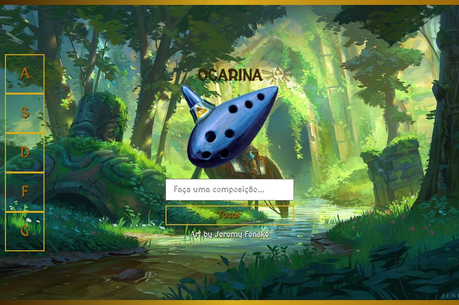

# Ocarina
> site para estudo de javaScript

## Objetivo do projeto:
tocar por meio de comandos de teclas um son correspodente a uma nota de uma ocarina

##

Projeto construído como exercício do curso da B7web
> Prevista a otimização para sua responsividade em dispositivos mobile, e animações.

[Clique aqui para acessar](https://rafael-damasceno.github.io/Ocarina-sons/)

## Tecnologias:

- HTML
- CSS
- Git e Github
- JavaScript